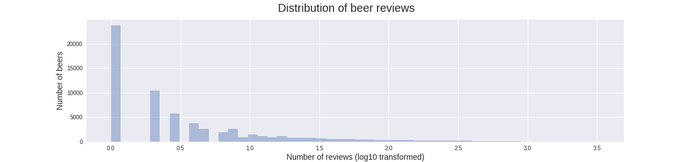
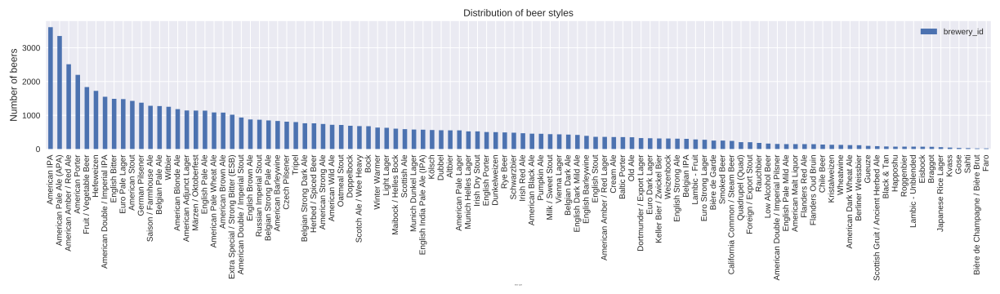
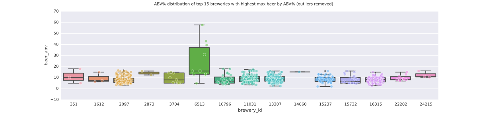
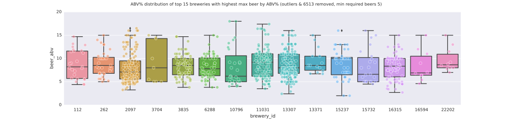

```python
from IPython.core.display import HTML
HTML("""
<style>
code {
    padding:2px 4px !important;
    color: #c7254e !important;
    font-size: 90%;
    background-color: #f9f2f4 !important;
    border-radius: 4px !important;
    color: rgb(138, 109, 59);
}
mark {
    color: rgb(138, 109, 59) !important;
    font-weight: bold !important;
}
.container { width: 90% !important; }
table { font-size:15px !important; }
</style>
""")
```


<style>
code {
    padding:2px 4px !important;
    color: #c7254e !important;
    font-size: 90%;
    background-color: #f9f2f4 !important;
    border-radius: 4px !important;
    color: rgb(138, 109, 59);
}
mark {
    color: rgb(138, 109, 59) !important;
    font-weight: bold !important;
}
.container { width: 90% !important; }
table { font-size:15px !important; }
</style>


```python
import pandas as pd
import seaborn as sns
from matplotlib import pyplot as plt 
import os, sys

sys.path.insert(0, '../../src/data/')
import utils

%matplotlib inline 
path_raw = "../../data/raw/beer_reviews"

# LOAD DATA
# we assume the file we're after is a
# single .csv in path_raw
for file in os.listdir(path_raw):
    file = os.path.join(path_raw, file)
    if os.path.isfile(file) and '.csv' in file: 
        dat_raw = pd.read_csv(file)
```

# Introduction

This notebook serves as the master report document which will present the analysis results for the CiBO data science exercise. The exercise is structured around a beer review data set available [online](https://urldefense.proofpoint.com/v2/url?u=https-3A__s3.amazonaws.com_demo-2Ddatasets_beer-5Freviews.tar.gz&d=DwMFaQ&c=imBPVzF25OnBgGmVOlcsiEgHoG1i6YHLR0Sj_gZ4adc&r=8bgQeuykrF3aSX4ERnAE37e9TNni25ddf39sbnkKHrQ&m=hkI6yrD7SBn4Z9WO9Zt31KmSuYIswplFpvMihrHqFd4&s=PStqu-SKl1ZEMNBu4MLVtzHvrTddC9h1mM3NqDgmYmI&e=) for which the following must be explored:
> 1. Which brewery produces the strongest beers by ABV%?
> 2. If you had to pick 3 beers to recommend using only this data, which would you pick?
> 3. Which of the factors (aroma, taste, appearance, palette) are most important in determining the overall quality of a beer?
> 4. If I enjoy a beer's aroma and appearance, which beer style should I try?

## Initial data exploration

The starting point of this analysis is to get a sense of what the data looks like and how it's organized, notebook [1.0](../explore/1.0_initial_look.ipynb) covers this initial investigation. The input data has the following caveats:
- The dataset is composed of a series of beer reviews containing scores for numerous categories. Each data entry also has an associated brewery and beer style.
- The following attribute fields have special characters (e.g. accents) in them: `brewery_name`, `beer_style`, `beer_name`.
- Several attributes have missing values: `brewery_name`, `review_profilename` and `beer_abv`. We aren't too concerned about `brewery_name` since we have associated `brewery_id` with them. However, `review_profilename` will be needed if we want to compare across reviewers. A total of 17,043 beers have a missing values for `beer_abv`.
- The distribution of beers reviews is not normal: the majority of beers have only a two reviews, however on average, each beer is reviewed about 24 times. </img>
- Similarly, each brewery is not represented with the same number of beers: the average number of beers reviewed for the 5840 breweries in the dataset is ~11 where as the median is 5. </img>
- Of the 66,055 beer represented, the most highly represented style is *American IPA* or *American Pale Ale (APA)*. </img>
- The distribution of alcohol by volume percentage (ABV%) is roughly normal with the presence of numerous outliers. </img>

## Q1: Which brewery produces the strongest beers by ABV%?

### Introduction

The notebook [2.0](../explore/2.0_brewery_highest_abv.ipynb) explore this questions. 

There are several issues with the ABV% data contained in the beer review data set:
1. As mentioned previously, numerous beers (17,043) have missing values for ABV%; this represents about 25% of the total beers available in the dataset. It is unclear why this data is missing. One potential way around this would be to constuct a model that could predict ABV% based on the scored review features (e.g. `review_taste`) as well as the `beer_style`. This was not done as part of this analysis; instead, those beers without an ABV% were ignored.
2. Some breweries have many more beers associated with them than others (as shown above in the intial data exploration), therefore it is unclear whether having only a single strong beer qualifies the brewery as having the "strongest beers". <mark>For this analysis, we will assume that a brewery must have at least 5 beers for it to qualify for this questions.</mark>
3. The initial data exploration also mentions the inherent noise with the ABV% metric, especially in the high-ABV range; this will have to be taken into account when electing beers.
4. Because several of the breweries do not have any associated names, we will identify breweries by the `brewery_id` attribute throughout the analysis.

### Dealing with noisy ABV%

We being by naivly looking at which brewery has the highest ABV% beers without removing any noisy data in order to get a general sense of the data. To do that, we generate a *beer dataset* which contains only the meatdata associated with beer, this is done by grouping the starting dataset on `beer_beerid` and simply grabing the first entry of each group. From this *beer dataset* we group on `brewery_id`, aggregate with *max*, and sort the breweries by max ABV*; the plot below shows the top 15 breweries with the highest ABV% beer.


Several interesting insights can be seen in this plot:
- Noisy high-ABV beers help rank several breweries very well.
- Brewery 6513 seems to be a general outlier when compared to the remaining breweries. In general it has very high ABV beers; it's median beer ABV is nearly higher than most all other beers represented. It is a possibility that this entiry brewery represents some sort of anomoly.

In order to remove the noise, we will use the John Tukey method of detecting outliers: that is, any beer with an ABV% value that is more than Q3 + 1.5 * IQR  or less than Q1 + 1.5 * IQR is considered an outlier. Where IQR is the inner quartile range, Q1 is the first quartile, and Q3 is the third quartile.

After removing outliers, we can replot the same top 15 breweries



- We can see that the ABV% values for all of the breweries are much more concentrated
- We can also see that several breweries with very few beers enter the list - a brewery with very few beers is perhaps not very representative of a brewery that is able to produce strong beers, we therefore choose to set a threshold of 5 beers needed in order for a brewery to be considered for this analysis. The disadvantage of this is that 5 is a relatively arbitrary cutoff. 
- Brewery 6513 did not contain any outliers, however it now looks to be even more anamolous when compared to the reamining breweries; <mark>we therefore elect to call brewery 6513 erroneous and we remove it from consideration</mark>

With both noisy beers and brewery 6513 removed with arrive at the following ditribution of breweries:



From the plot above, we can begin to see several candidates for highest beer ABV% brewery: 2097, 11031, 10796 and 13307:
- 10796 has two beers with the absolute highest ABV%
- 2097, 11031 and 13307 has a cluster of high ABV% beers

### Choosing a brewery

If one were to choose a brewery by the single most high-ABV% beer, the winner would be brewery 10796; however if one were to consider multiple high-ABV% beers together, a different brewery would be chosen. In the data presented above, the 95th percentile is 14.48, if one were to calculate the number of beers above this percentile we would see:


```python
cutoff = 14.48
dat = pd.read_csv('../../data/interim/high_beer_ABV_breweries.csv')
beer_counts = dat[dat.beer_abv > cutoff].groupby('brewery_id').agg(['count','median','mean'])[['beer_abv']]
beer_counts.sort_values(('beer_abv','count'),ascending=False).head(5)
```


<div>
<table border="1" class="dataframe">
  <thead>
    <tr>
      <th></th>
      <th colspan="3" halign="left">beer_abv</th>
    </tr>
    <tr>
      <th></th>
      <th>count</th>
      <th>median</th>
      <th>mean</th>
    </tr>
    <tr>
      <th>brewery_id</th>
      <th></th>
      <th></th>
      <th></th>
    </tr>
  </thead>
  <tbody>
    <tr>
      <th>2097</th>
      <td>9</td>
      <td>15.0</td>
      <td>15.388889</td>
    </tr>
    <tr>
      <th>11031</th>
      <td>8</td>
      <td>16.3</td>
      <td>16.150000</td>
    </tr>
    <tr>
      <th>13307</th>
      <td>7</td>
      <td>15.0</td>
      <td>15.131429</td>
    </tr>
    <tr>
      <th>10796</th>
      <td>3</td>
      <td>18.0</td>
      <td>16.833333</td>
    </tr>
    <tr>
      <th>15732</th>
      <td>3</td>
      <td>15.0</td>
      <td>15.166667</td>
    </tr>
  </tbody>
</table>
</div>


The breweries 2097, 11031, and 13307 all have a high number of beers (9, 8, 7 respectively) that are in the 95th percentile of highest ABV% beers amongn only those breweries that produce high ABV% beers. Since these numbers are quite similar, we use the median/mean ABV% to decide which brewery tends to brew numerous high ABV% beers: **11031**.

### Summary

We have determined that brewery **11031 (Brouwerij De Molen)** produces more of the strongest ABV% beers than any other brewery, this is contigent on the following assumptions:
- brewery 6513 is an anomaly.
- a brewery must product at least 5 beers to be considered.
- a single very high ABV% beer does not automatically select the given brewery since precedence is given to those breweries that produce multiple strong beers (i.e. 1 very strong beer is not better than 10 slightly less strong beers).

It should be reiterated that we are excluding about 25% of the beers due to missing ABV% values; this represents a large fraction of the total data and thus creates some concern regarding whether any of these missing beers might be a high-ABV% beer. One way to get around that would be to build a predictive model based on the current data - this would prove to be a difficult task due to the fact that high-ABV% beers aren't very common. Most models would thus not predict a beer to be high ABV%

## Q2: If you had to pick 3 beers to recommend using only this data, which would you pick?

### Introduction

The notebook [3.0](../explore/3.0_recommend_3_beers.ipynb) explores this questions.

There are several issues with the given question:
- it is unclear by what metric one might recommend beers on, <mark>for the purpose of this question, we will only use `review_overall` to gauge the "goodness" of a beer.</mark>
- several of the reviews don't have an associated `review_profilename` value for it. <mark>Given that those reviews without a profilename represent a small fraction of the total reviews, we will exclude these reviews from the analysis.</mark>
- beers are categorized by `beer_style` it is conceivable that a best beer could be chosen for each style, <mark>for the purpose of this questions, the attribute `beer_style` is not taken into account</mark>
- as was mentioned in the intial data exploration, the number of reviews per beer varies drastically between beers; therefore we cannot naivly choose those beers with the highest `review_overall` scores.

### Removing suspicious reviews (trolls)

Before we being using the review that in order to gauge which beers are best, we need to get a sense for the quality of the scores provided in the dataset. It is conceivable that there exists reviewers that are not interested in actually rating the beer, but are rather interested in drinking the beer; we will call these reviewers trolls: that is, reviewers that do not accurately provide review scores.

In order to identify trolls we subset the reviewers down to those that have reviewed more than 3 times, and for which the standard deviation of their supplied `review_overall` scores is 0 - this means that the reviewer gave the same score for all of the reviews they provided. We deem these reviews as low quality and remove them from the dataset. All in all, the analysis identified 50 reviewers that were deemed trolls and subsequently removed from the analysis; find the list of trolls in *data/interim/trolls.csv*

### Determining best beer

Since we cannot simply elect those beers with the highest `review_overall` score (since this would simply select all those beers with a single review of 5.0), we must take into account the number of times a beer was reviewed as well as its resulting score.

We identify top ranked beers by doing the following:
1. For each of the remaining non-troll reviewers <u>that have reviewed more than a single beer</u>, we sort the reviewed beers by decreasing `review_overall` score. We then descend the list of ranked beers until we've recorded at least 3 beers. In cases of multiple tied beer scores, we descend further into the list until the tie is broken. In this way, we guarantee to record each reviewers "best" beers. (this has been implemented in the function *get_highest_rated_beers()* found in *utils.py*).
2. Next we generate a count for the number of times each beer was chosen as a best beer by all the reviewers.
3. We then rank the beers by the number of times it was voted best beer and add various other metrics. These data were written to the file found at *data/interim/best_beers.csv*


```python
top10 = pd.read_csv('../../data/interim/best_beers.csv', index_col=0).head(10)
top10
```


<div>
<table border="1" class="dataframe">
  <thead>
    <tr style="text-align: right;">
      <th></th>
      <th>counts as best beer</th>
      <th>avg review_overall</th>
      <th>avg review_aroma</th>
      <th>avg review_appearance</th>
      <th>avg review_taste</th>
      <th>avg beer_abv</th>
      <th>number of reviews</th>
      <th>counts with top score</th>
      <th>brewery_name</th>
      <th>beer_style</th>
      <th>beer_name</th>
    </tr>
    <tr>
      <th>beer_beerid</th>
      <th></th>
      <th></th>
      <th></th>
      <th></th>
      <th></th>
      <th></th>
      <th></th>
      <th></th>
      <th></th>
      <th></th>
      <th></th>
    </tr>
  </thead>
  <tbody>
    <tr>
      <th>7971</th>
      <td>1362</td>
      <td>4.590028</td>
      <td>4.612188</td>
      <td>4.388603</td>
      <td>4.630985</td>
      <td>8.0</td>
      <td>2527</td>
      <td>1067</td>
      <td>Russian River Brewing Company</td>
      <td>American Double / Imperial IPA</td>
      <td>Pliny The Elder</td>
    </tr>
    <tr>
      <th>695</th>
      <td>909</td>
      <td>4.342180</td>
      <td>4.151082</td>
      <td>4.512862</td>
      <td>4.329522</td>
      <td>8.5</td>
      <td>2449</td>
      <td>591</td>
      <td>Brouwerij Duvel Moortgat NV</td>
      <td>Belgian Strong Pale Ale</td>
      <td>Duvel</td>
    </tr>
    <tr>
      <th>731</th>
      <td>898</td>
      <td>4.516414</td>
      <td>4.296465</td>
      <td>4.381061</td>
      <td>4.425505</td>
      <td>5.4</td>
      <td>1980</td>
      <td>695</td>
      <td>Bayerische Staatsbrauerei Weihenstephan</td>
      <td>Hefeweizen</td>
      <td>Weihenstephaner Hefeweissbier</td>
    </tr>
    <tr>
      <th>17112</th>
      <td>882</td>
      <td>4.377609</td>
      <td>4.533156</td>
      <td>4.242530</td>
      <td>4.518420</td>
      <td>10.0</td>
      <td>2443</td>
      <td>630</td>
      <td>Bell's Brewery, Inc.</td>
      <td>American Double / Imperial IPA</td>
      <td>Bell's Hopslam Ale</td>
    </tr>
    <tr>
      <th>1093</th>
      <td>854</td>
      <td>4.330216</td>
      <td>4.266593</td>
      <td>4.154199</td>
      <td>4.319399</td>
      <td>7.0</td>
      <td>2727</td>
      <td>554</td>
      <td>Bell's Brewery, Inc.</td>
      <td>American IPA</td>
      <td>Two Hearted Ale</td>
    </tr>
    <tr>
      <th>11757</th>
      <td>847</td>
      <td>4.354658</td>
      <td>4.412035</td>
      <td>4.364454</td>
      <td>4.501200</td>
      <td>8.3</td>
      <td>2501</td>
      <td>507</td>
      <td>Founders Brewing Company</td>
      <td>American Double / Imperial Stout</td>
      <td>Founders Breakfast Stout</td>
    </tr>
    <tr>
      <th>2093</th>
      <td>840</td>
      <td>4.145485</td>
      <td>4.213439</td>
      <td>4.192156</td>
      <td>4.325935</td>
      <td>9.0</td>
      <td>3289</td>
      <td>396</td>
      <td>Dogfish Head Brewery</td>
      <td>American Double / Imperial IPA</td>
      <td>90 Minute IPA</td>
    </tr>
    <tr>
      <th>34</th>
      <td>791</td>
      <td>4.298027</td>
      <td>4.231977</td>
      <td>4.193919</td>
      <td>4.396093</td>
      <td>9.0</td>
      <td>2483</td>
      <td>492</td>
      <td>Unibroue</td>
      <td>Tripel</td>
      <td>La Fin Du Monde</td>
    </tr>
    <tr>
      <th>276</th>
      <td>772</td>
      <td>4.245845</td>
      <td>3.915539</td>
      <td>3.995168</td>
      <td>4.115385</td>
      <td>5.6</td>
      <td>2587</td>
      <td>416</td>
      <td>Sierra Nevada Brewing Co.</td>
      <td>American Pale Ale (APA)</td>
      <td>Sierra Nevada Pale Ale</td>
    </tr>
    <tr>
      <th>412</th>
      <td>765</td>
      <td>4.174116</td>
      <td>4.198553</td>
      <td>4.374116</td>
      <td>4.342122</td>
      <td>9.0</td>
      <td>3110</td>
      <td>342</td>
      <td>North Coast Brewing Co.</td>
      <td>Russian Imperial Stout</td>
      <td>Old Rasputin Russian Imperial Stout</td>
    </tr>
  </tbody>
</table>
</div>


The table above presents 10 of the "best" beers as ranked by `review_overall`. We can see that beer 7971 is a very highly ranked beer, that has been reviewed many times (2527) and which recieved a perfect score of 5.0 a total of 1067 times (see column *counts with top score*). However, as we descend down the column *counts as best beer* the remaining beers seem to be equally "good" with counts in the ranges 800 to 900. One issue with using just this count value is that, as we sas previously, these beers aren't ranked the same number of times. Take for example beer 2093, which was ranked over 3,000 times; compare that to the slightly less than 2,000 times beer 731 was ranked.

In order to decide the remaining best beers, we will calculate the effect size of the beers `review_overall` scores against all the remaining beers in the dataset. We will use [Cohen's d](https://en.wikipedia.org/wiki/Effect_size#Cohen.27s_d) to calculate the effect size and recommend those beers with the highest effect size.


```python
effect_size = dict()
for beer in top10.index:
    a = dat_raw[dat_raw.beer_beerid==beer].review_overall
    b = dat_raw[dat_raw.beer_beerid!=beer].review_overall
    effect_size[beer] = utils.cohen_d(a,b)
    
effect_size = pd.DataFrame(effect_size, index=[0]).transpose()
effect_size.columns = ['cohen_d']
effect_size.sort_values('cohen_d', ascending=False).head(3)
```


<div>
<table border="1" class="dataframe">
  <thead>
    <tr style="text-align: right;">
      <th></th>
      <th>cohen_d</th>
    </tr>
  </thead>
  <tbody>
    <tr>
      <th>7971</th>
      <td>1.077399</td>
    </tr>
    <tr>
      <th>731</th>
      <td>0.973617</td>
    </tr>
    <tr>
      <th>17112</th>
      <td>0.781491</td>
    </tr>
  </tbody>
</table>
</div>


### Summary

Given the data at hand, we would recommend the beers:
1. **7971 (Pliny The Elder, Russian River Brewing Company)**
2. **731 (Weihenstephaner Hefeweissbier, Bayerische Staatsbrauerei Weihenstephan)**
3. **17112 (Bell's Hopslam Ale, Bell's Brewery, Inc.)** 

since they are ranked to be the best overall beers as deemed by the reviewers; this is contingent on:

- removing those reviews with no associated reviewer name
- removing those reviews from those reviewers that reviewed only a single beer or where deemed to be trolls
- beers were judged only by the `review_overall` scores because it was assumed this metric most accurately represented the "goodness" of a beer.

## Q3: Which of the factors (aroma, taste, appearance, palette) are most important in determining the overall quality of a beer?

### Introduction

The notebook [4.0](../explore/4.0_factors_for_beer_quality.ipynb) explores this questions.

Another way of phrasing the question is to determine which factors (`review_aroma`, `review_taste`, `review_appearance` or `review_palette` explain the most variance in the overall quality of beer (`review_overall`). Given the results from the previous two questions we know that we can do the following:
- remove the reviews that had no associated `review_profilename`
- there were numerous "troll" reviewers which should be removed from the dataset (trolls written to *../../data/interim/trolls.csv*)

<mark>It is assumed that the overall quality of beer is directly measured by the attribute `review_overall`.</mark>

We can take multiple regression approaches to identifying which factor is more important in determing the overall quality of beer; in the analysis below, we will apply these multiple approaches to arrive at a consensus of which factor is most important.

### Analysis

We begin our first approach by simply applying a univariate linear regression of each factor on `review_overall`; in doing so we can measure how correlated each factor is to the overall quality. The table below shows the results of those regressions with each factor:


```python
pd.read_csv('../../data/interim/beer_factors_linear_regression.csv', index_col=0).sort_values('r^2', ascending=False)
```


<div>
<table border="1" class="dataframe">
  <thead>
    <tr style="text-align: right;">
      <th></th>
      <th>r^2</th>
      <th>p</th>
      <th>std err</th>
    </tr>
    <tr>
      <th>factor</th>
      <th></th>
      <th></th>
      <th></th>
    </tr>
  </thead>
  <tbody>
    <tr>
      <th>review_taste</th>
      <td>0.623780</td>
      <td>0.0</td>
      <td>0.000495</td>
    </tr>
    <tr>
      <th>review_palate</th>
      <td>0.492664</td>
      <td>0.0</td>
      <td>0.000535</td>
    </tr>
    <tr>
      <th>review_aroma</th>
      <td>0.379439</td>
      <td>0.0</td>
      <td>0.000605</td>
    </tr>
    <tr>
      <th>review_appearance</th>
      <td>0.251726</td>
      <td>0.0</td>
      <td>0.000587</td>
    </tr>
  </tbody>
</table>
</div>


Using this technique, we can see that `review_taste` explains the most variance in `review_overall` (r^2 = 0.62). This issue with this technique however is that it treats each factor as independent and does not consider any additive or interaction effects. To take those into account we run a multivariate linear model analysis on the data and allow for full interaction between all terms; the results below show the summary of that analysis.


```python
with open('../../data/interim/ols.txt', 'r') as fin:
    ols = ''.join(fin.readlines())
print ols
```

                                OLS Regression Results                            
    ==============================================================================
    Dep. Variable:         review_overall   R-squared:                       0.664
    Model:                            OLS   Adj. R-squared:                  0.664
    Method:                 Least Squares   F-statistic:                 2.087e+05
    Date:                Tue, 20 Jun 2017   Prob (F-statistic):               0.00
    Time:                        23:01:59   Log-Likelihood:            -8.6659e+05
    No. Observations:             1586266   AIC:                         1.733e+06
    Df Residuals:                 1586250   BIC:                         1.733e+06
    Df Model:                          15                                         
    Covariance Type:            nonrobust                                         
    =============================================================================================================================
                                                                    coef    std err          t      P>|t|      [95.0% Conf. Int.]
    -----------------------------------------------------------------------------------------------------------------------------
    Intercept                                                     0.5373      0.041     13.086      0.000         0.457     0.618
    review_aroma                                                 -0.0797      0.020     -4.062      0.000        -0.118    -0.041
    review_appearance                                            -0.1243      0.014     -8.696      0.000        -0.152    -0.096
    review_aroma:review_appearance                               -0.0022      0.006     -0.387      0.699        -0.013     0.009
    review_palate                                                 0.2483      0.019     12.927      0.000         0.211     0.286
    review_aroma:review_palate                                    0.0687      0.007      9.774      0.000         0.055     0.082
    review_appearance:review_palate                              -0.0441      0.006     -7.810      0.000        -0.055    -0.033
    review_aroma:review_appearance:review_palate                  0.0161      0.002      8.612      0.000         0.012     0.020
    review_taste                                                  0.5646      0.022     25.605      0.000         0.521     0.608
    review_aroma:review_taste                                     0.0099      0.007      1.461      0.144        -0.003     0.023
    review_appearance:review_taste                                0.1050      0.006     16.240      0.000         0.092     0.118
    review_aroma:review_appearance:review_taste                  -0.0117      0.002     -6.396      0.000        -0.015    -0.008
    review_palate:review_taste                                    0.0365      0.007      5.491      0.000         0.023     0.049
    review_aroma:review_palate:review_taste                      -0.0239      0.002    -12.900      0.000        -0.028    -0.020
    review_appearance:review_palate:review_taste                 -0.0161      0.002     -8.951      0.000        -0.020    -0.013
    review_aroma:review_appearance:review_palate:review_taste     0.0022      0.000      4.643      0.000         0.001     0.003
    ==============================================================================
    Omnibus:                    86434.813   Durbin-Watson:                   1.804
    Prob(Omnibus):                  0.000   Jarque-Bera (JB):           353400.563
    Skew:                          -0.052   Prob(JB):                         0.00
    Kurtosis:                       5.310   Cond. No.                     4.39e+04
    ==============================================================================
    
    Warnings:
    [1] Standard Errors assume that the covariance matrix of the errors is correctly specified.
    [2] The condition number is large, 4.39e+04. This might indicate that there are
    strong multicollinearity or other numerical problems.


The main takeaway from these results is that the r^2 value of this much more complex model (0.664) is not appreaceable better than the univarate model using just `review_taste`. This further points us in the direction that `review_taste` has the most impact on `review_overall` scores.

A final approach is to train a Random Forest regression model on the entire dataset and use the feature importance scores it produces as a gauge for the most important factor.

### Summary

<mark>TODO</mark>

## Q4: If I enjoy a beer's aroma and appearance, which beer style should I try?

The notebook [5.0](../explore/5.0_beer_style.ipynb) explores this questions.

This questions, as opposed to the previous one, is a classification type problem. We are interested in identifying which class of `beer_style` is most highly correlated with high scores for both `review_aroma` and `review_appearance`. We will tackle this problem first by using simple descriptive stats, and then later by using numerous machine learning models.

As we've identified in previous analyses, we will be removing any reviews that do not have an associated reviewer name and we will also be removing the "trolls".

### Introduction

### Summary

## Q5: Generate 10,000 random numbers (i.e. sample) from a Logistic distribution with parameters “location" = 10 and “scale” = 2.

Please refer to notebook [6.0](../explore/6.0_bonus.ipynb) for the proposed solution.

